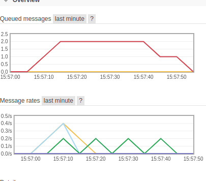

RabbitMQ Queue Messaging Magento2 module prototype
======

Magento2 module prototype to publish and consume message by AMQP and RabbitMQ

Please notice sleep 10 to see consuming easily

##Usage
docker exec -it --user www-data training_web_233 /bin/bash -c "cd magento && bin/magento queue:consumers:list"

docker exec -it --user www-data training_web_233 /bin/bash -c "cd magento && bin/magento mdykas:rabbitMessage --message='Hello Rabbit'"

docker exec -it --user www-data training_web_233 /bin/bash -c "cd magento && bin/magento queue:consumers:start mdykasHungryConsumer"

## Tests
docker exec -it --user www-data training_web_233 /bin/bash -c "cd magento && vendor/bin/phpcs --config-set colors 1"

docker exec -it --user www-data training_web_233 /bin/bash -c "cd magento && vendor/bin/phpcs --exclude=PSR2.Methods.MethodDeclaration,PSR2.Classes.PropertyDeclaration --extensions=php --standard=PSR2 app/code/Mdykas/RabbitQueue -s"

docker exec -it --user www-data training_web_233 /bin/bash -c "cd magento && vendor/bin/phpcs --extensions=php --standard=PSR2 app/code/Mdykas/RabbitQueue -s"

docker exec -it --user www-data training_web_233 /bin/bash -c "cd magento && vendor/bin/phpcs --extensions=php --standard=dev/tests/static/framework/Magento/ruleset.xml app/code/Mdykas/RabbitQueue -s"

docker exec -it --user www-data training_web_233 /bin/bash -c "cd magento && vendor/bin/phpmd app/code/Mdykas/RabbitQueue text dev/tests/static/testsuite/Magento/Test/Php/_files/phpmd/ruleset.xml"

docker exec -it --user www-data training_web_233 /bin/bash -c "cd magento && vendor/bin/phpcs app/code/Mdykas/RabbitQueue --standard=Magento2 --severity=10 --extensions=php,phtml"

